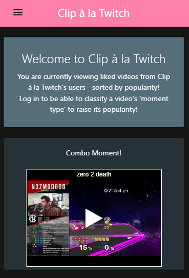
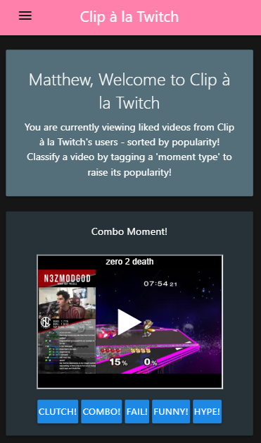
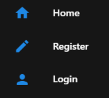
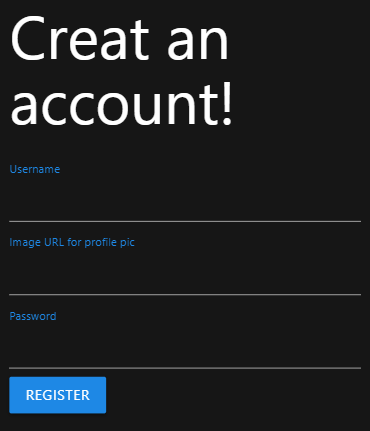
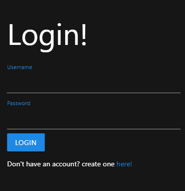
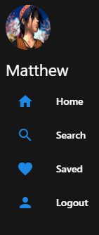
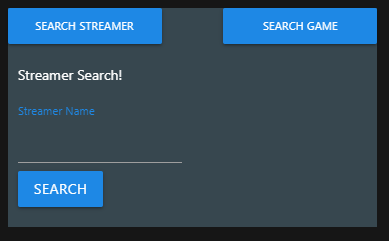
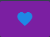
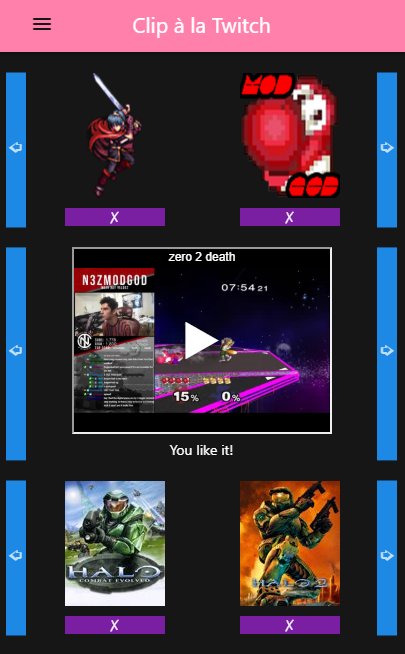

# Clip &#224; la Twitch

Welcome to Clip &#224; la Twitch, the site for everything Twitch clip related!

Check out the home page to view liked user clips.

If you log in you will be able to say what kind of video it is, raising its popularity!

To log in go to the Navigation bar -

Click the menu button &nbsp;  &nbsp; to view the menu options.

You can either register or login -

- Register

- Log in

- - -

Once Logged in you have access to new menu &nbsp;  &nbsp; options.

Click logout from this menu to securely log out.

Visit the search page to find streamers and games to follow.

- Using the search form look for streamers or games by clicking the corresponding button.

- Enter the game name or streamer name in the field then hit submit.

When the game or streamer information pops up you can -

- Follow that streamer or game by clicking the heart &nbsp;  &nbsp; button

- Unfollow that streamer or game by clicking the unheart &nbsp;  &nbsp; button

- - -

Being logged in also grants access to your saved (followed) streamers and games.

- At any time click the &nbsp;  &nbsp; to remove a streamer or game from your lists.

By clicking a streamer or game picture it will populate recent clips if there are any, or, their all time best clips if they haven't had clips posted in a few days.

You can like a video by clicking the heart &nbsp;  &nbsp; button. This will push that clip to the homepage so others can enjoy it too!

- - -

